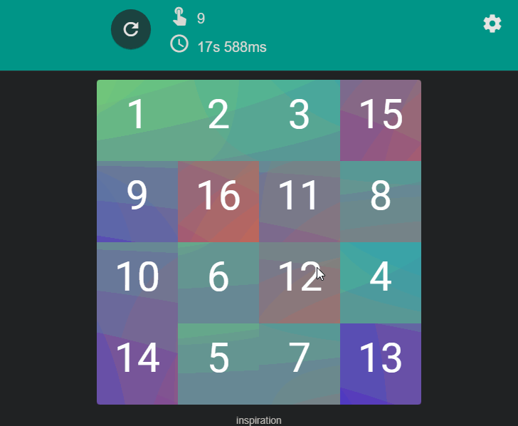
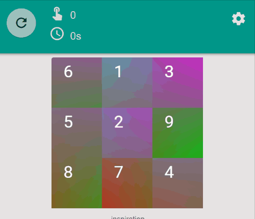
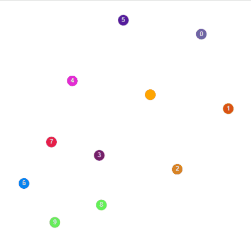
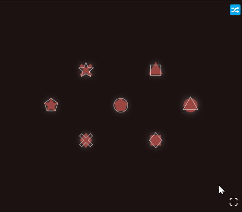

# about  

this project from January 2019 is not an original idea, but a remake of [carykh's loopover](https://www.youtube.com/watch?v=95rtiz-V2zM).  

it can be played here:  

https://torus-tiles.netlify.app/

---

i particularly like how opening the settings turned out and also the sliders for width and height.  

there was also some experimentation with interlocked wheels:  

in January 2021 (so 2 years later), i made another small game based on this principle, which can be played here:  

https://loop-intersection-puzzle.netlify.app/  

